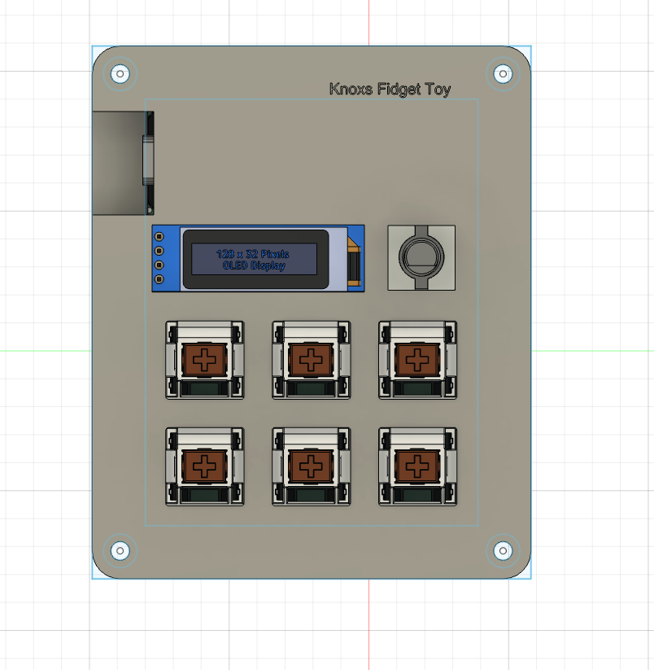
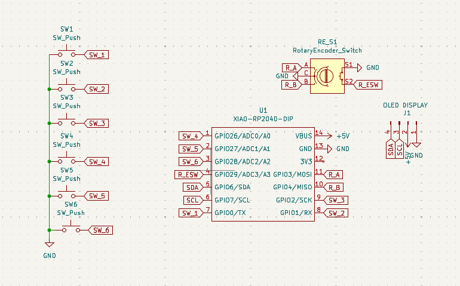
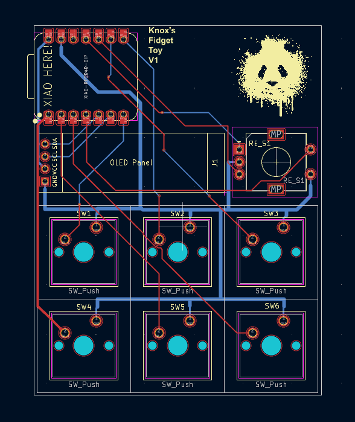
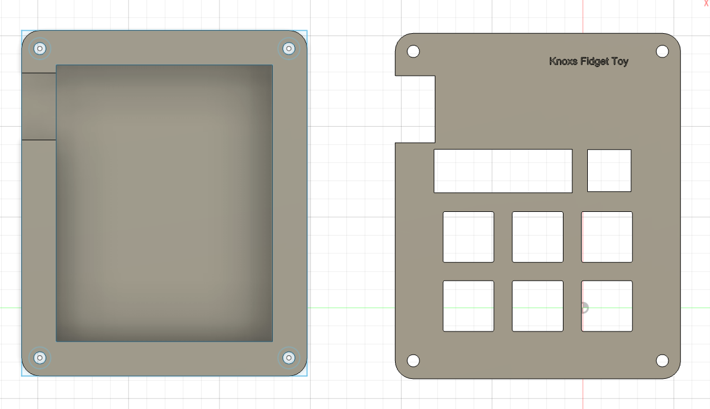

Hi Reader(s),
I used KiCAD, Fusion360, and once I get the parts, VSCode.
I spent about 14 Hours, across 2 days (I locked in).

This project requires a Seeed XIAO RP2040, 
6 MX-Style switches, 
1 EC11 Rotary encoder, 
1 0.91 inch OLED display, 
6 Blank DSA keycaps (White), 
4 M3x16mm screws, 
4 M3x5mx4mm heatset inserts,
and a top and bottom 3d printed case.

## Pictures

| Schematic | PCB | Case |
|:-:|:-:|:-:|
|  |  |  |

